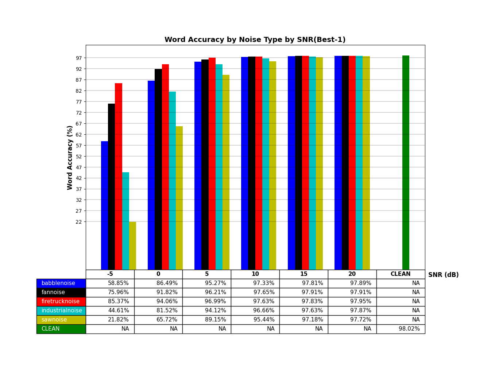

# SPEAR-SDK-Python-Linux

SPEAR-SDK-Python-Linux is SPEAR's software development kit that allows you to integrate SPEAR-ASR and SPEAR-WakeUp to voice-enable your Python applications in Linux. The SPEAR-ASR engine will terminate after 10 minutes of processing speech. SPEAR-WakeUp will not terminate after 10 minutes. For continuous operation, contact us at info@think-a-move.com. 

This repository requires Git Large File Storage. Follow installation instructions [here](https://docs.github.com/en/repositories/working-with-files/managing-large-files/installing-git-large-file-storage).

By cloning this repository and downloading SPEAR-SDK library you agree to the [SPEAR-SDK EULA](./LICENSE).

## Contents:

- [SpearSdk-5.1.0.tar.gz](./SpearSdk-5.1.0.tar.gz) - SPEAR-SDK library for Python consisting of SPEAR-ASR and SPEAR-WakeUp.

- SPEAR-ASR is an on-device automatic speech recognition engine that delivers superior recognition accuracy in high noise environments and provides both command recognition and free-form transcription. Developed for use by military medics in the battlefield.

- SPEAR-WakeUp is an on-device lightweight Wake word detection system that has very low power consumption.

- Documentation for the API and app integration is located in the docs directory.   

- SpearSdkExample.py is an example Python application that demonstrates how to integrate our SPEAR-SDK library and language model with Python applications

## Features
- Noise-robust DNN-Based Acoustic Model
- Noise-robust DNN-Based VAD Model
- Domain-specific Language Model
- Works Offline
- Supports NBest results
- Supports Command and Control (finite state) Applications
- Supports Transcriptions (statistical)
- Speaker Independent
- Grammar switching at runtime
- Dynamic grammar compilation (Grammar on-the-fly)
- Supports 16K Audio Sampling Rate
- Down-sample to 8K or 16K
- Low CPU consumption of Wake-up Word 
- Java language support
- Floating point version
- Barge-in support

## Languages
- Chinese - Mandarin
- English
- French
- Spanish
- We can train other languages or augment existing languages. Contact us at info@think-a-move.com.

## Acoustic Models
- Optimized for high-noise
- We can train acoustic models for specific noise environments. Contact us at info@think-a-move.com.
- Accuracy results using WSJ Corpus mixed with various noise samples

## Services we can provide
- Create customized Acoustic Models
- Create domain Specific Language Models
- Extend additional functionality of SPEAR-ASR to address specific needs
- Voice-enable your application or make one for you
- Contact us at info@think-a-move.com.